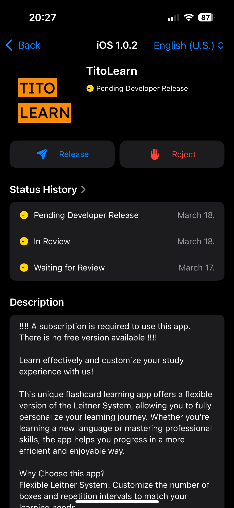
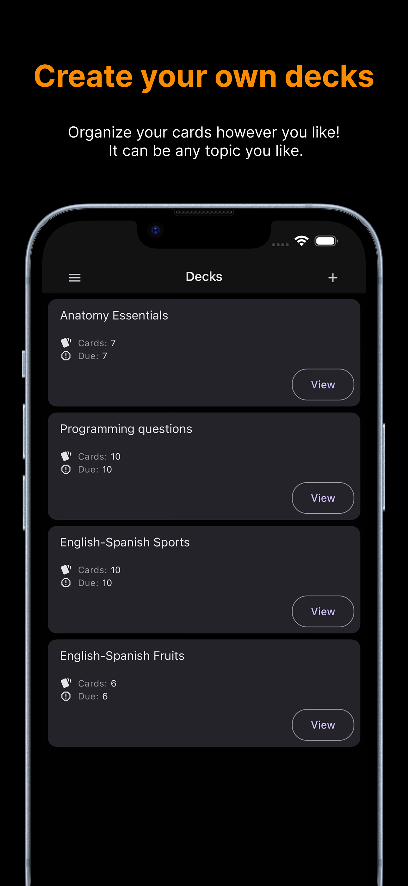
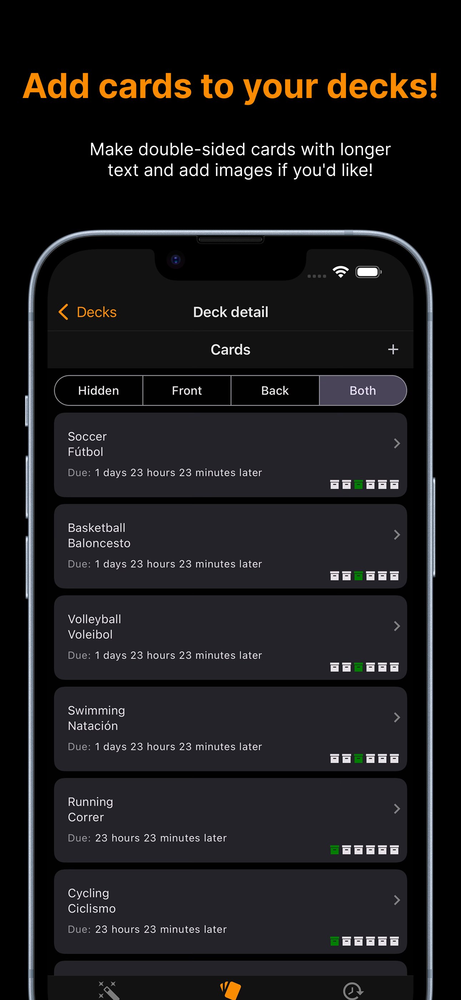
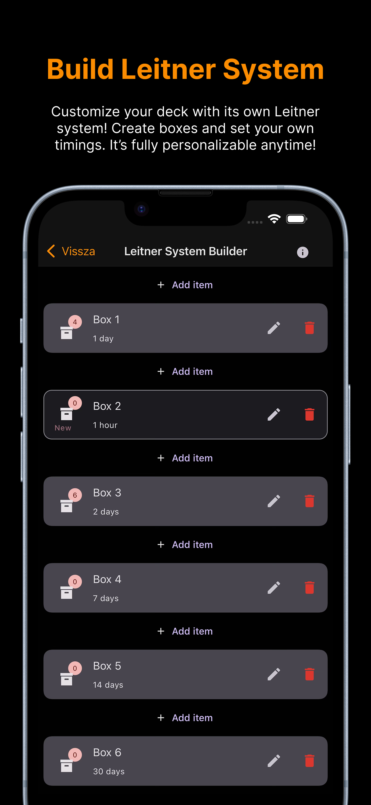
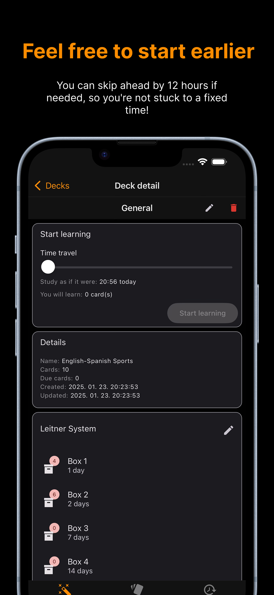
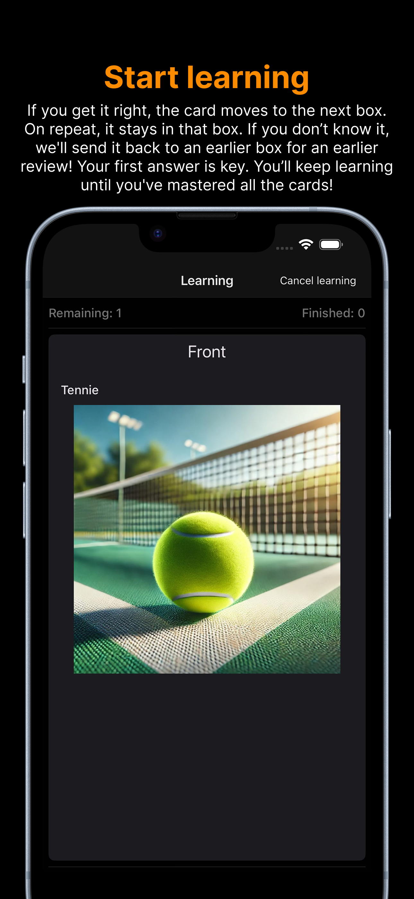
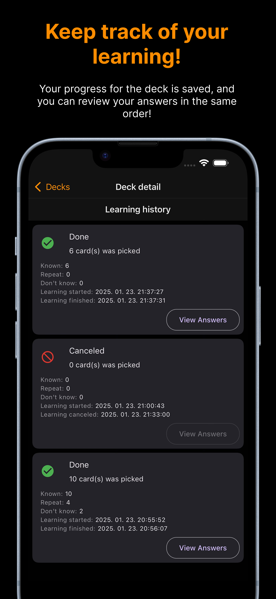
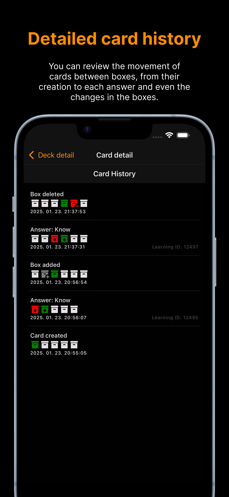

## TitoLearn

The app is a releasable version, and Apple has approved it, including the subscription. However, I ultimately decided not to publish the app. (cause of costs and risks)

The backend is an API built on Laravel 10, though I haven’t published (yet?) its code. On the Laravel side, every endpoint has permission tests. However, some behavior-based tests were still missing. The backend runs behind a Docker Compose setup consisting of simple Nginx, MySQL, and PHP images, making it easy to move around. In fact, I had to migrate it several times—starting from my laptop, then moving to a desktop PC, a Raspberry Pi, and even a rented VPS. Initially, I used AWS S3 for file storage, but later I reverted to the default Laravel storage system. I also encountered new things in Laravel, so in the end, I can say the invested effort was worthwhile.

[YouTube Video](https://www.youtube.com/watch?v=s-VJy17OegE)

[YouTube Video 2](https://www.youtube.com/shorts/tEnwk1udK1Y)

## Images

  
  
  
  
  
  
  
  
  
 

Any questions? kecsot08@gmail.com

## FAQ From the app

### What is the Leitner System?
The Leitner system is an effective learning method used for repetition-based memorization. Cards are sorted into different boxes, and their position changes during the learning process depending on how well the user knows the answer. If you know the answer, the card moves forward to the next box; if not, it moves back. This method aids long-term memorization.

The Leitner system is a scientifically supported method that enhances learning efficiency through the timing of repetitions. Spaced repetition, according to psychological research, strengthens long-term memory as learners see the more difficult cards more often while encountering easier ones less frequently, allowing the brain to focus energy on weaker areas.

---

### What happens if I want to study immediately but a few hours are left?
It’s important to follow the intervals properly. Most users prefer to study at a specific time each day. Without intervals, their study time would shift later and later each day. To address this, we introduced the **"Threshold" slider**, which allows users to study up to 12 hours in advance. This way, if you need to finish your daily study earlier, it’s no problem. However, use this cautiously, as overusing it may contradict the core principle of the Leitner system: periodic repetition.

---

### How does the Leitner system work in the app?
Each deck follows a default system that works generally well. New cards are placed in the first box. The default Leitner system includes **5 boxes**:

- **Box 1**: Daily review.
- **Box 2**: Review after two days.
- **Box 3**: Review after one week.
- **Box 4**: Review after two weeks.
- **Box 5**: Review after one month (30 days).

---

### Why is it useful to customize the Leitner system settings?
Beyond the default boxes and intervals, users can define a **custom number of boxes and intervals** for each box. This allows the learning process to be tailored to individual needs. Some learners may require more frequent repetitions. This flexibility supports personalized growth.

---

### What happens if I delete a box that contains cards?
The system automatically **moves the cards to the preceding box**. If a card in the first box is deleted, it will be placed in the next box. Each card retains a log of these changes, so even if a box modification occurs, the card’s history remains trackable.

---

### How do different answers affect card movement?
During learning, you can give **three types of answer**:

- **“I don’t know”** → The card moves to a previous box.
- **“Repeat”** → The card stays in the current box.
- **“I know”** → The card moves to the next box.

The learning continues until every card receives an “I know” answer, but the crucial decision lies in your initial response.

---

### How can I track my learning progress?
There are **two ways** to do this:

1. **Deck Learning History:** Available on the deck details page, where you can see when you started studying, how long the session lasted, and what responses you gave. Clicking on an entry shows a detailed list of your responses for each card.
2. **Card History:** You can track the history of individual cards, including responses given and how the card moved through the boxes. Changes resulting from customizations in the Leitner system are also visible.

---

### What happens when a card reaches the last box?
Based on the **interval set for the last box**, you will encounter the card again to ensure you never forget its content.

---

### What does the “Learning ID” next to a card history row mean?
This is a **technical identifier** that shows during which learning session the response occurred, allowing you to link responses together.

---

### What happens if I delete a card?
The card’s entire **history and all associated data, including images, will be deleted**. Restoration is not possible.

---

### What happens if I delete a deck?
All data associated with the deck, including cards and their related information as described above, will be **deleted permanently**. Restoration is not possible.